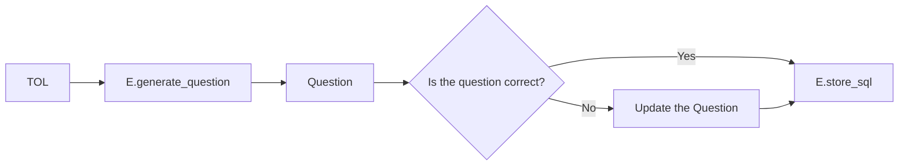

## What do I need to do to use **ERIC.AI**?
ERIC.AI uses a combination of documentation and historical question and Test case  pairs to generate TOL from natural language.

### Step 1: Train **Eric.AI**
- Give **ERIC.AI** sample TOL
- **ERIC.AI** will try to guess the question
- Verify the question is correct

### Step 2: Ask **ERIC.AI** a Question

